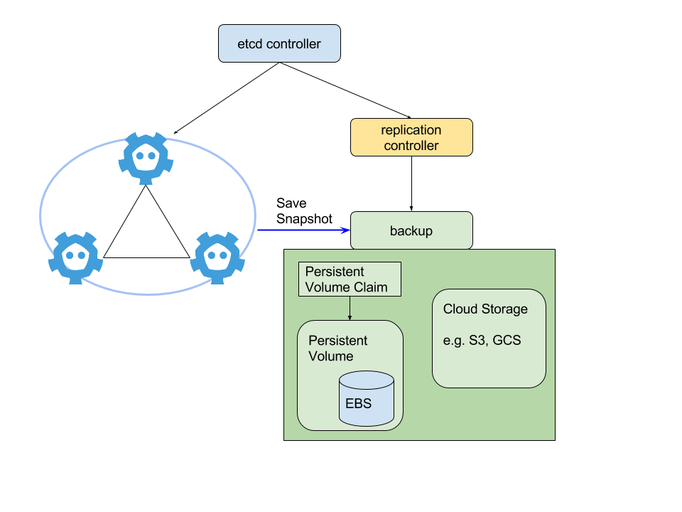

# Disaster Recovery

## Overview

If a cluster has less than majority of members alive, controller considers it disastrous failure. There might be other disastrous failures. Controller will do disaster recovery on such cases and try to recover entire cluster from snapshot.

We have a backup pod to save checkpoints of the cluster.

If disastrous failure happened but no checkpoint is found, controller would consider the cluster dead.

## Technical details

We have a backup pod as sidecar:
- We use Kubernetes replication set to manage the backup pod to achieve highly availability.
- It periodically pull snapshots from the etcd cluster.
- It persists the pulled snapshot into attached stable storage like Persistent Volume or cloud storage like GCS/S3.
- It serves latest snapshot to etcd members for disaster recovery.

## Disaster recovery process

Recovery process of entire cluster:
- If there is any running members, we first save snapshot of the member with the highest storage revision.
  Then we kill all running members.
- Restart the cluster as a one member cluster. The seed member will do recovery process described below.
- Then the reconciliation will start to bring the etcd cluster back to the desired number of members.

Recovery process of an etcd emember:
- pull the latest snapshot from its backup pod, and use etcdctl recovery to prepare initial state.
- start etcd process.
Note that this could happen not only in disaster recovery, but also in partial recovery.

## Architecture diagram
